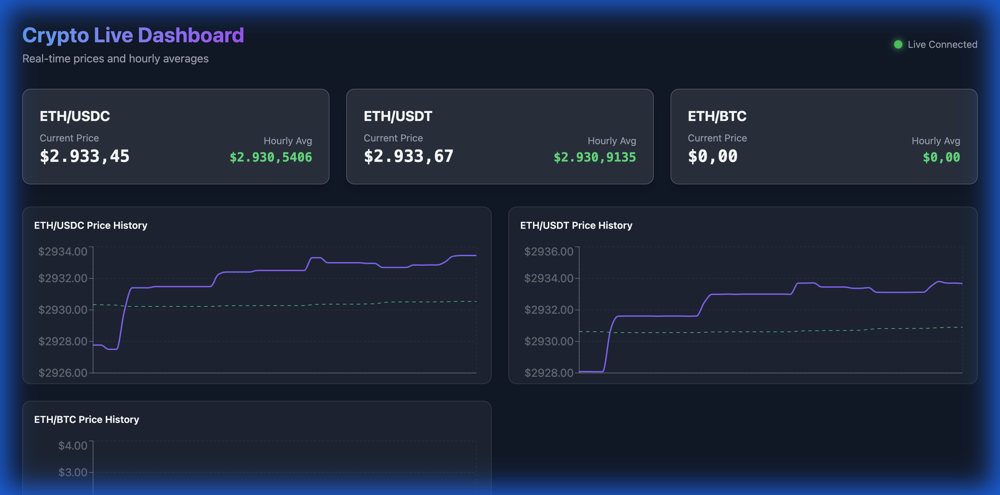

# Real-time Crypto Dashboard

A production-ready real-time cryptocurrency dashboard built with NestJS and React, displaying live prices and hourly averages for ETH/USDC, ETH/USDT, and ETH/BTC pairs from Finnhub.



> **Note:** The ETH/BTC pair shows zero values in the screenshot because Finnhub's WebSocket is not currently providing data for this exchange pair. The dashboard gracefully handles this by displaying zeros while continuing to stream live data for ETH/USDC and ETH/USDT.

## Prerequisites

**Choose one of the following setup methods:**

### Option A: Manual Setup

- Node.js (v16+)
- npm or pnpm

### Option B: Docker Setup

- Docker (v20.10+)
- Docker Compose (v2.0+)

**Both options require:**

- Finnhub API Key (Get one for free at [finnhub.io](https://finnhub.io/))

---

## Quick Start

### Option A: Manual Setup

#### 1. Clone and Install

```bash
# Install backend dependencies
cd backend
npm install

# Install frontend dependencies
cd ../frontend
npm install
```

#### 2. Configure Environment

```bash
# From project root
cp .env.example .env
# Edit .env and set your FINNHUB_API_KEY
```

#### 3. Run the Application

**Terminal 1 - Backend:**

```bash
cd backend
npm run start:dev
```

Backend runs on `http://localhost:3000`

**Terminal 2 - Frontend:**

```bash
cd frontend
npm run dev
```

Frontend runs on `http://localhost:5173`

Open your browser to `http://localhost:5173` to see the dashboard.

---

### Option B: Docker Setup

Run both backend and frontend in a single container:

#### 1. Create Environment File

```bash
# Create .env file in project root
echo "FINNHUB_API_KEY=your_api_key_here" > .env
```

#### 2. Build and Run

**With Docker Compose (recommended):**

```bash
docker-compose up --build
```

**Or with Docker directly:**

```bash
docker build -t crypto-dashboard .
docker run -d -p 3000:3000 -p 5173:5173 -e FINNHUB_API_KEY=your_key crypto-dashboard
```

#### 3. Access the Application

Open your browser to `http://localhost:5173` to see the dashboard.

---

## Testing

### Backend Tests (30 tests)

```bash
cd backend
npm test              # Run all tests
npm run test:e2e      # Run E2E tests only
npm run lint          # Check code quality
```

### Frontend Tests (51 tests)

```bash
cd frontend
npm test              # Run all tests
npm run test:ui       # Run tests with UI
npm run lint          # Check code quality
```

**Total: 81 automated tests** covering unit, integration, E2E, and component testing.

## Features

- **Real-time Data**: Live cryptocurrency prices via WebSocket streaming
- **Hourly Averages**: Automatic calculation of rolling hourly price averages
- **Interactive Charts**: Historical price visualization with Recharts
- **Connection Status**: Visual indicators for WebSocket connection state
- **Error Handling**: Graceful error recovery and automatic reconnection
- **Responsive Design**: Modern UI with Tailwind CSS and glassmorphism effects

## Architecture & Design Decisions

### Real-time Data Flow

```
Finnhub WebSocket → FinnhubService → CryptoGateway → Socket.IO → React Frontend
```

1. **FinnhubService** (Backend)

   - Maintains persistent WebSocket connection to Finnhub
   - Subscribes to trade data for 3 crypto pairs
   - Calculates hourly averages from trade history
   - Implements automatic reconnection with 5-second delay
   - Cleans up data older than 1 hour to prevent memory leaks

2. **CryptoGateway** (Backend)

   - WebSocket gateway using Socket.IO for client connections
   - Streams aggregated data to all connected clients every second
   - Manages client lifecycle (connect/disconnect)
   - Only streams when clients are connected (resource efficient)

3. **useCryptoData Hook** (Frontend)

   - Custom React hook for WebSocket state management
   - Maintains connection to backend gateway
   - Builds historical data (last 50 points per symbol)
   - Handles connection errors and reconnection

4. **Dashboard Components** (Frontend)
   - **CryptoCard**: Displays current price and hourly average with color coding
   - **PriceChart**: Line charts showing price history
   - Connection status indicator with live/disconnected states

### Key Architectural Decisions

**Why NestJS?**

- Built-in dependency injection for clean architecture
- Native WebSocket support with `@nestjs/websockets`
- Excellent TypeScript support and type safety
- Modular structure for scalability

**Why Socket.IO over native WebSocket?**

- Automatic reconnection handling
- Fallback transport mechanisms
- Event-based communication (cleaner than raw messages)
- Better browser compatibility

**Why separate Finnhub and Gateway services?**

- Single Finnhub connection shared across all clients (cost-effective)
- Backend aggregates and processes data before streaming
- Clients receive consistent, processed data
- Easier to add caching or rate limiting later

**Data Management:**

- Backend maintains 1 hour of trade history per symbol
- Frontend keeps last 50 data points for charts
- Automatic cleanup prevents memory leaks
- Efficient data structures (Maps for O(1) lookups)

**Error Handling:**

- Backend: Automatic WebSocket reconnection, graceful error logging
- Frontend: Error state display, connection status indicators
- E2E tests verify error recovery scenarios

## Project Structure

```
able/
├── backend/
│   ├── src/
│   │   ├── crypto/          # WebSocket gateway for clients
│   │   ├── finnhub/         # Finnhub WebSocket service
│   │   └── main.ts          # Application entry point
│   └── test/                # E2E tests
├── frontend/
│   ├── src/
│   │   ├── components/      # React components
│   │   ├── hooks/           # Custom React hooks
│   │   └── App.tsx          # Main application
│   └── __tests__/           # Component & hook tests
└── README.md
```

## Technologies

**Backend:**

- NestJS - Framework
- Socket.IO - WebSocket server
- ws - Finnhub WebSocket client
- Jest - Testing

**Frontend:**

- React - UI framework
- TypeScript - Type safety
- Socket.IO Client - Real-time connection
- Recharts - Data visualization
- Tailwind CSS - Styling
- Vitest - Testing

## Development

```bash
# Backend development
cd backend
npm run start:dev    # Hot reload
npm run build        # Production build
npm run lint         # Lint code

# Frontend development
cd frontend
npm run dev          # Development server
npm run build        # Production build
npm run preview      # Preview production build
npm run lint         # Lint code
```

## Production Deployment

**Backend:**

```bash
cd backend
npm run build
npm run start:prod
```

**Frontend:**

```bash
cd frontend
npm run build
# Serve the dist/ folder with your preferred static server
```

## Environment Variables

**Backend (.env):**

```
FINNHUB_API_KEY=your_api_key_here
```

**Frontend:**
Backend URL is configured in `src/hooks/useCryptoData.ts` (default: `http://localhost:3000`)

## License

MIT
